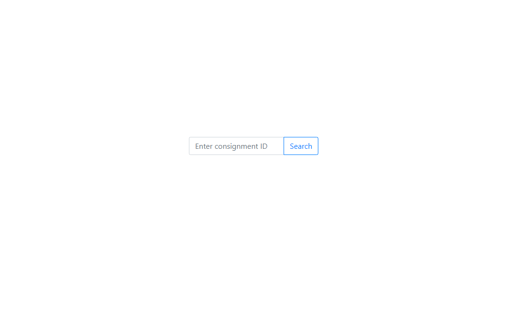
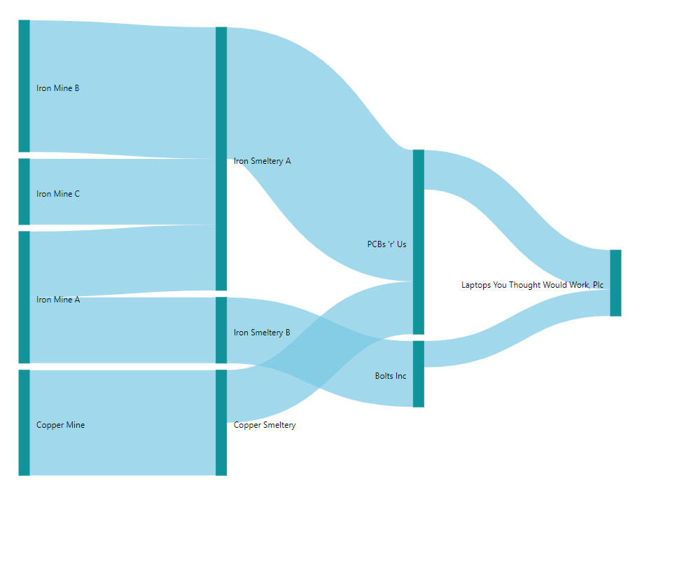

# LogCoin

# Ericsson Logistics Challenge

## Come up with a solution that can help and detect fraudulent shipments in supply chains in order to avoid unsustainable and inhumane conditions taking place in production

## Agenda 2030 goal

---

#### Goal 12: Responsible consumption and production

[Achieving economic growth and sustainable development requires that we urgently reduce our ecological footprint by changing the way we produce and consume goods and resources...](https://www.undp.org/content/undp/en/home/sustainable-development-goals/goal-12-responsible-consumption-and-production.html)

## Authors
Henrik Bostöm
Gustav Kjellberg
Teo Klestrup Röijezon

## Proposed solution

In order to globally make consumption and production responsible we belive that the entire population need to strive for change. One of the most crucial steps in order to change the world for the better is increase the general knowledge of current issues, as so perfectly demonstrated by Greta Thunberg. Thus, the main objective with our proposed solution is to increase the general knowledge about how and where consumed products are produced, and that requires transparancy.

The logistic and production chain that a product goes through before reaching consumers is unknown to most people. We belive that making this supply chain easily traceable for everyone, will drastically increase awareness and by that make the population strive for more responsible consumption.

We have created a fully transparent transaction log (which could be a blockchain to avoid a centralized dependency) of every step in the supply chain when creating products, that is easily readable for everyone using data visualization.

Each manufacturer in the chain writes to the log about the transaction or convertion of materials and/or products so that it accurately reflects their inventory. This is done throughout the entire supply chain so that when revicing a finished product the consumer can, with full transparancy, follow every step that has led to creating the consumed product.

Furhtermore, this enables the consumer to not only see that the phone they've bought was shipped from a certain warehouse, but also that the minaral ores used when producing components came from a specific mine. One can then examine if the, in this case mine, is sustainable or not.

Professionals can use the tool to examine if the shipped material reflects their transactions and thus identify fraud. E.g. A smeltery says that they only work with sustainable mines and has recived 1 tonnes of ores from those, i.e. their inbound transaction is equivalent of 1 tonnes. Though, their outbound transaction of material yielded from those ores is larges, thus there something that do not add up. Maybe they are also reciving ores from other, more cheaper and probably unsustainable mines on the side?

Finally, the application can also be used for each manufacturer in the supply chain. E.g. A main can verify that the smeltery do not use their ores to create metal for producing wepons.

## Current status

---

The current application uses a accounting ledger database that is used by a web application that can extract and visualize the transaction data. This enables the user to easily get an understanding of the supply chain and all the steps involved.

## stack

---

- React
- Scala
- Postgres

## Future work

---

- This solution could utilize block chain technology in order to avoid centralized dependency.
- The current web application displays the supply chain on a very basic level and should be extended with functionlity to go into each node prested.
- Future development should strive to make the applikation easily integrateble with existing IT-systems.
- Users should be able to get the information by scanning a QR code or similar.
- Could be integrated with the Internet of Logistics to correlate with shipping details and warehousing concerns.
